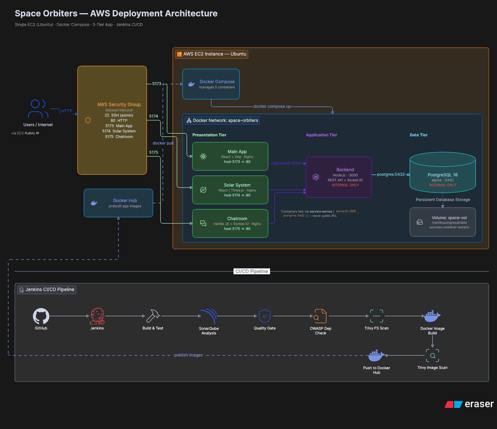
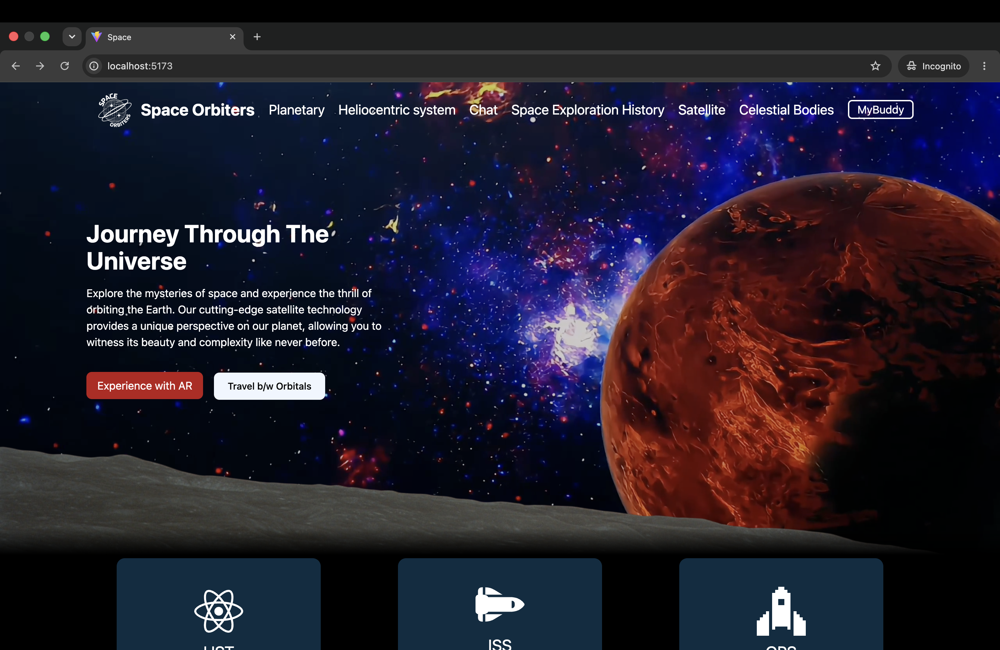
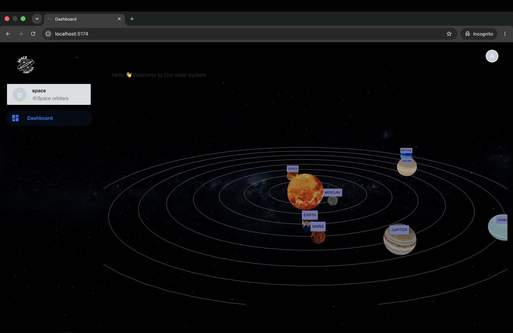
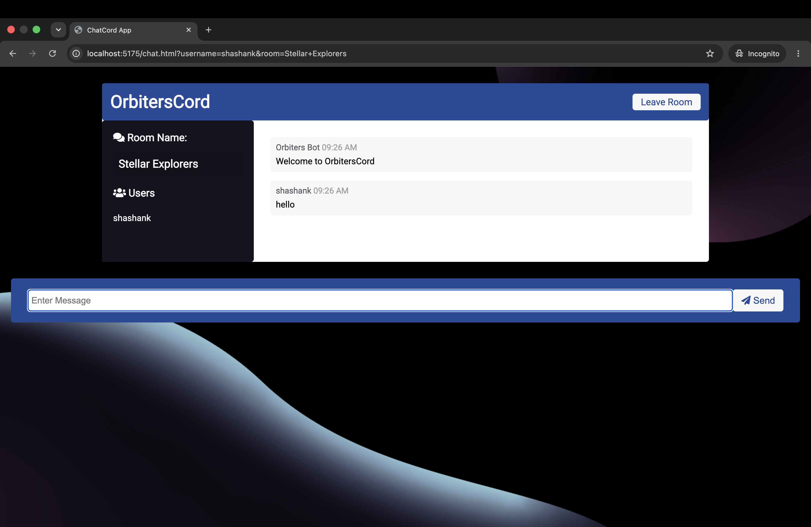
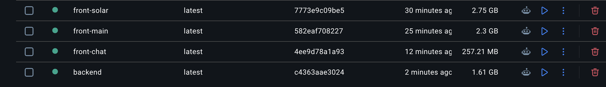
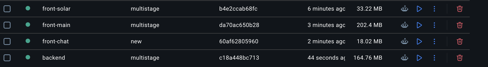

# Space Orbiters

> **Original Project:** https://github.com/saswat2004/SPACE_ORBITERS

Space Orbiters is a space-exploration project with React frontends, a Node.js/Express backend, Socket.IO real-time chat, and PostgreSQL persistence.

This repository is based on the original **SPACE_ORBITERS** project above and has been restructured, fixed, and containerized to make the application easier to run, deploy, and maintain.

## Architecture

```text
React main app ───────┐
                      │ HTTP
React solar system ───┼────────> Node.js + Express + Socket.IO
                      │                    │
Chat browser ─────────┘                    │ SQL
                                           ▼
                                      PostgreSQL
```

## Project Structure

```text
SPACE_ORBITERS/
├── frontend/
│   ├── main-app/              # Main React + Vite website
│   ├── solar-system/          # React + Three.js solar-system application
│   └── chatroom/              # HTML/CSS/JS chat client
│
├── backend/
│   ├── src/
│   │   ├── db/                # PostgreSQL connection pool
│   │   ├── routes/            # REST API routes
│   │   ├── socket/            # Socket.IO chat + PostgreSQL persistence
│   │   └── server.js          # Express + Socket.IO entry point
│   ├── package.json
│   ├── Dockerfile
│   └── Dockerfile.multistage
│
├── init/
│   ├── 01-schema.sql          # PostgreSQL schema
│   └── 02-seed.sql            # PostgreSQL seed data
│
├── docker-compose.yml
└── README.md
```

## System Design — Full Project on EC2 with DevSecOps

The application is designed to run as a 3-tier Docker Compose stack on a single AWS EC2 (Ubuntu) instance, secured behind an AWS Security Group with inbound rules limited to SSH (22), HTTP (80), and the three frontend ports (5173, 5174, 5175).



**Presentation tier** — `main-app`, `solar-system`, and `chatroom`, each served by Nginx (host ports 5173/5174/5175 → container port 80).

**Application tier** — the Node.js/Express + Socket.IO backend on port 3000, reachable only inside the Docker network via the service name `backend:3000` — never exposed with a public IP.

**Data tier** — PostgreSQL 16 (Alpine) on port 5432, also internal-only, reachable via `postgres:5432`, with data persisted on the `space-vol` volume mounted at `/var/lib/postgresql/data` so it survives container restarts.

All containers communicate over the `space-orbiters` Docker network by service name rather than by public IP, and the prebuilt application images are pulled from Docker Hub rather than built on the EC2 instance itself.

The diagram also shows the target Jenkins CI/CD pipeline (GitHub → Jenkins → Build & Test → SonarQube → OWASP Dependency Check → Trivy scans → Docker Hub → EC2 deployment) — as noted in [DevSecOps](#devsecops) below, this pipeline is planned and not yet implemented; the EC2/Docker Compose deployment portion above is what's currently in place.
The frontend applications are served through Nginx in their production Docker images.

## Application Preview

The three frontend containers running side by side:

#### Main App — `http://localhost:5173`



#### Solar System — `http://localhost:5174`



#### Chatroom — `http://localhost:5175`



> **Note:** these separate ports are only visible here because the apps are being accessed directly for the screenshot/demo. In normal use, the Main App's navigation (e.g. the **Chat** link) routes to the other applications on your behalf — you don't need to know or manually type any port numbers.

## Improvements and Contributions

This repository contains several changes and improvements made on top of the original project.

### 1. Project Structure

The original project structure was difficult to maintain — each app (`Spaceorbitersmain`, `chatroom`, `spaceorbiterclickplanets`) lived as a loose top-level folder, each with its own duplicate config files (`package.json`, `package-lock.json`), alongside a root-level `package.json`/`package-lock.json` that didn't clearly belong to any single app.

**Before:**

```text
SPACE_ORBITERS/
├── Spaceorbitersmain/
│   ├── public/
│   ├── src/
│   ├── index.html
│   ├── package.json
│   ├── package-lock.json
│   ├── postcss.config.js
│   ├── tailwind.config.js
│   └── vite.config.js
│
├── chatroom/
│   ├── public/
│   ├── utils/
│   ├── package.json
│   ├── package-lock.json
│   └── server.js
│
├── spaceorbiterclickplanets/
│   └── ...
│
├── .gitignore
├── README.md
├── package.json
└── package-lock.json
```

The application was reorganized into clear frontend and backend sections instead:

**After:**

```text
frontend/
├── main-app/
├── solar-system/
└── chatroom/

backend/
└── src/
    ├── db/
    ├── routes/
    └── socket/
```

This makes each application easier to develop, containerize, and deploy independently.

### 2. Main App Navigation Fixes

The main application's navigation and routing behavior was fixed so that the different application sections can be accessed correctly.

Changes were made in the main application's components, including:

- `Hero.jsx`
- `Navbar.jsx`

The navigation between the main application and the other application sections was corrected to work properly with the deployed application.

### 3. Deployment and Routing Changes

Hardcoded local development URLs were removed or replaced where required so that the application can run outside the local development environment.

The application was configured to work with the production Docker/Nginx setup and can be deployed on an AWS EC2 instance without depending on `localhost` addresses in the frontend.

### 4. Database Migration: MongoDB → PostgreSQL

The original application used MongoDB. The database layer was changed to **PostgreSQL**.

The backend was updated to:

- Use the `pg` PostgreSQL client.
- Create a PostgreSQL connection pool.
- Read PostgreSQL connection details from environment variables.
- Connect to PostgreSQL through the Docker Compose service name.
- Persist chat and application data in PostgreSQL.

The PostgreSQL database is initialized using SQL files:

```text
init/
├── 01-schema.sql
└── 02-seed.sql
```

The PostgreSQL service uses a persistent Docker volume so database data survives container recreation.

### 5. Backend Environment Configuration

The backend supports PostgreSQL connection configuration through environment variables.

Example:

```text
POSTGRES_HOST=postgres
POSTGRES_PORT=5432
POSTGRES_DB=space_orbiters
POSTGRES_USER=space_orbiters
POSTGRES_PASSWORD=change_me
```

The application can also construct a PostgreSQL connection URL from these values.

### 6. Dockerization

Docker support was added for the application components.

Both regular and optimized multi-stage Dockerfiles were added where applicable.

The multi-stage builds separate the build environment from the production runtime environment, keeping unnecessary build dependencies out of the final runtime image.

The production frontend containers use Nginx to serve the built frontend applications.

### 7. Docker Image Optimization

Multi-stage Docker builds were used to significantly reduce the size of the production images by keeping build dependencies out of the final runtime images.

| Image | Before (single-stage) | After (multi-stage) | Size reduction |
|---|---|---|---|
| `front-solar` | 2.75 GB | 33.22 MB | ~98.8% |
| `front-main` | 2.3 GB | 202.4 MB | ~91.2% |
| `front-chat` | 257.21 MB | 18.02 MB | ~93.0% |
| `backend` | 1.61 GB | 164.76 MB | ~89.8% |

The largest gains came from the frontend images — `front-solar` in particular dropped from 2.75 GB to about 33 MB once the Node/npm build toolchain was excluded from the final Nginx-served runtime image. The backend followed the same pattern, cutting roughly 90% of its size by separating the `npm ci` build stage from the final runtime stage.

#### Before Optimization



#### After Multi-Stage Optimization



> **Note:** for these screenshots to render on GitHub, the actual image files need to exist at `docs/docker-image-sizes-before.png` and `docs/docker-image-sizes-after.png` in the repo — add a `docs/` folder with these two images if it isn't already committed.

### 8. Docker Compose Deployment

The application is orchestrated using Docker Compose.

The Compose setup contains:

```text
postgres
backend
main-app
solar-system
chatroom
```

The three frontend applications are exposed through separate host ports:

```text
Main App       → 5173
Solar System   → 5174
Chatroom       → 5175
```

The backend runs on:

```text
3000
```

and PostgreSQL runs internally on:

```text
5432
```

The services communicate through the Docker network:

```text
space-orbiters
```

The backend connects to PostgreSQL using:

```text
postgres:5432
```

rather than using `localhost`.

### 9. Docker Hub Deployment

The current Compose configuration uses Docker Hub images instead of building the application images on the deployment machine.

Current images:

```text
shashank971/space-orbiters-backend
shashank971/space-orbiters-main-app
shashank971/space-orbiters-solar-system
shashank971/space-orbiters-chatroom
```

Deployment can therefore pull the required application images and start the complete stack using Docker Compose.

## Backend API

The backend runs on port `3000`.

- `GET /` — backend information
- `GET /api/health` — backend + PostgreSQL health
- `GET /api/planets` — PostgreSQL planet records
- `GET /api/users` — PostgreSQL users
- `GET /api/messages` — PostgreSQL chat history
- `GET /api/launches` — backend proxy for launch data
- `/chat/` — browser chat client

## PostgreSQL

The application uses PostgreSQL as its persistent database.

The database contains tables for application data such as:

- `users`
- `planets`
- `messages`

Chat messages are persisted in PostgreSQL rather than being kept only in application memory.

PostgreSQL data is stored using the Docker named volume:

```text
space-vol
```

mounted at:

```text
/var/lib/postgresql/data
```

## Run With Docker Compose

Create/configure the environment variables required by the Compose configuration, then start the application:

```bash
docker compose pull
docker compose up -d
```

Check the running services:

```bash
docker compose ps
```

The applications are available at:

```text
Main App:       http://localhost:5173
Solar System:   http://localhost:5174
Chatroom:       http://localhost:5175
```

## Data Flow

### Planet Data

```text
Main React frontend
        ↓
GET /api/planets
        ↓
Express backend
        ↓
PostgreSQL
        ↓
planets table
```

### Chat

```text
Chatroom
   ↓
Socket.IO
   ↓
Node.js backend
   ↓
PostgreSQL
   ↓
messages + users
```

### Launch Data

```text
Main React frontend
        ↓
GET /api/launches
        ↓
Node.js backend
        ↓
External launch API
```

External NASA/space resources used by the existing UI remain external resources.

## Technology Stack

### Frontend

- React
- Vite
- React Router
- Tailwind CSS
- Three.js
- React Three Fiber
- Material UI
- D3.js
- Axios
- Nginx

### Backend

- Node.js
- Express
- Socket.IO
- PostgreSQL
- `pg`
- CORS
- dotenv

### Database

- PostgreSQL 16
- SQL schema and seed scripts

### DevOps / Deployment

- Docker
- Docker Compose
- Docker Hub
- Nginx
- AWS EC2

## Current Deployment Architecture

```text
                         Internet
                            │
             ┌──────────────┼──────────────┐
             │              │              │
           :5173          :5174          :5175
             │              │              │
             ▼              ▼              ▼
        ┌─────────┐   ┌─────────┐   ┌──────────┐
        │ Main App│   │  Solar  │   │ Chatroom │
        │  Nginx  │   │  Nginx  │   │  Nginx   │
        └────┬────┘   └────┬────┘   └────┬─────┘
             │             │             │
             └─────────────┼─────────────┘
                           ▼
                    ┌─────────────┐
                    │   Backend   │
                    │ Node + API  │
                    │    :3000    │
                    └──────┬──────┘
                           │
                       PostgreSQL
                          :5432
                           │
                           ▼
                      space-vol
```

All containers run on the Docker network:

```text
space-orbiters
```

## DevSecOps

A Jenkins-based DevSecOps CI/CD pipeline has been added to this project (`Jenkinsfile` at the repo root).

> ⚠️ **Not final yet.** The pipeline has been validated for syntax and stage logic offline, but has not yet had a full successful run against a real Jenkins instance. Some stage names, tool names, or credential IDs may still need adjustment once it's actually run — treat it as a work in progress rather than a finished, battle-tested pipeline.

### Shared Library

Rather than duplicating pipeline logic, the `Jenkinsfile` reuses steps from a separate, already-configured Jenkins shared library:

```text
https://github.com/shashankcodes-10/jenkins-shared-library.git
```

This library is registered in Jenkins under **Manage Jenkins → System → Global Pipeline Libraries** with the name `shared`, and is pulled in via:

```groovy
@Library('shared') _
```

at the top of the `Jenkinsfile`. It provides reusable steps for cloning, SonarQube analysis and quality gating, OWASP dependency checking, Trivy filesystem/image scanning, Docker image builds, Docker Hub pushes, deployment, and build-status email notifications — so the `Jenkinsfile` itself stays focused on orchestrating *this* project's stages rather than re-implementing each tool integration from scratch.

### Pipeline Stages

```text
Clone Repository
   ↓
SonarQube Analysis
   ↓
Quality Gate
   ↓
OWASP Dependency Check
   ↓
Trivy Filesystem Scan
   ↓
Build Docker Images (backend, main-app, solar-system, chatroom)
   ↓
Trivy Image Scan (per image)
   ↓
Push to Docker Hub (per image)
   ↓
Deploy (docker compose up -d --build)
```

Build status notifications (success/failure) are sent via the shared library's email step, and scan reports (Trivy filesystem/image, OWASP dependency-check) are archived as Jenkins build artifacts.

### Notes / Known Caveats

- The four application images are built directly from each service's `Dockerfile.multistage` (not the plain `Dockerfile`), using `--platform linux/amd64` to ensure amd64-compatible images regardless of the Jenkins agent's own architecture (e.g. when building from an Apple Silicon machine).
- The final `Deploy` stage runs `docker compose up -d --build` directly on the Jenkins agent — this assumes the agent itself has Docker access to the intended deployment target. If Jenkins runs somewhere other than the EC2 deployment host, this stage will need to be changed to deploy remotely (e.g. via SSH) instead.
- Jenkins tool names referenced in the pipeline (`jdk17` for the JDK, `sonar-scanner` for the SonarQube Scanner, `DP-Check` for OWASP Dependency-Check) and the `docker-hub-credentials` credential ID must be configured in Jenkins under **Manage Jenkins → Tools** / **Credentials** with matching names for the pipeline to run.
> Jenkins CI/CD integration is added and being tested; refinements are expected as it's run for real.